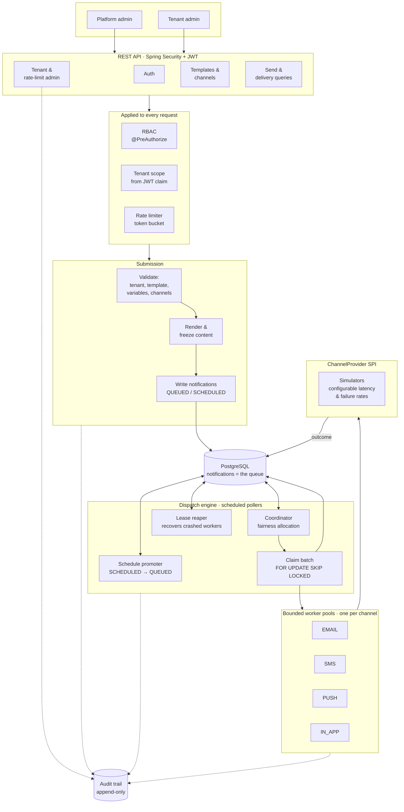
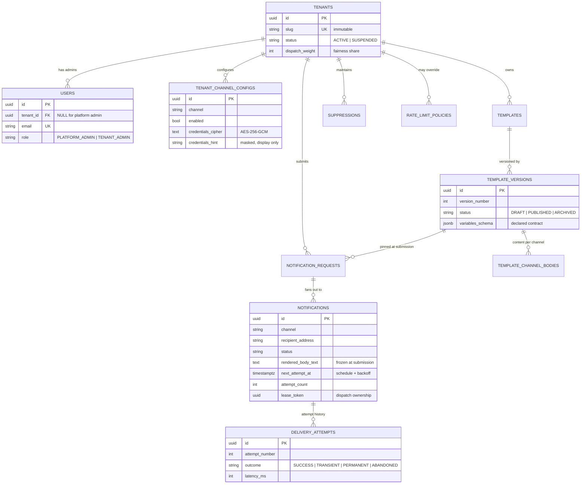
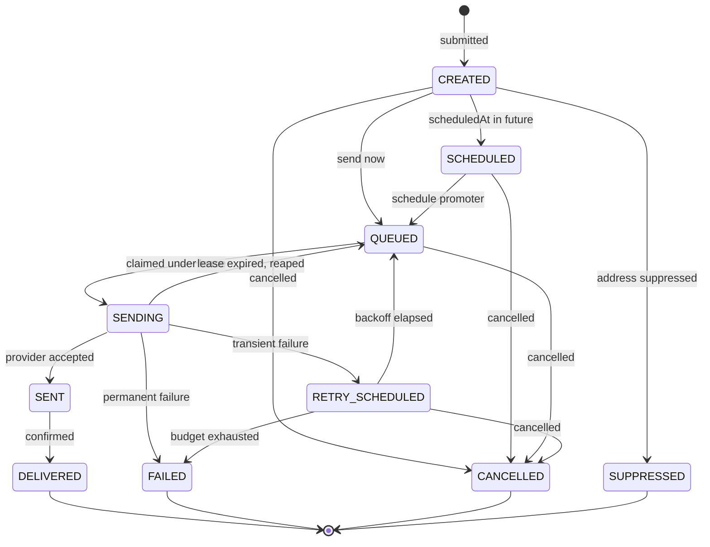

# Multi-Tenant Notification Service

A notification platform that delivers templated messages across **email, SMS, push and in-app**
for many tenants at once — with per-tenant templates and rate limits, immediate and scheduled
sends, concurrent dispatch through bounded worker pools, fairness between tenants under load,
retries with exponential backoff, duplicate-delivery prevention, and a full audit trail of every
state transition.

Built as an assignment. The original brief is preserved verbatim in
[`docs/00-original-requirement.md`](docs/00-original-requirement.md).

**Java 21 · Spring Boot 4.1.1 · PostgreSQL 16 · Flyway · Spring Security (JWT) · Testcontainers**

---

## Contents

- [Quick start](#quick-start)
- [What it does](#what-it-does)
- [Architecture](#architecture)
- [Data model](#data-model)
- [The notification lifecycle](#the-notification-lifecycle)
- [How the hard parts work](#how-the-hard-parts-work)
- [API reference](#api-reference)
- [Worked example](#worked-example)
- [Configuration](#configuration)
- [Testing](#testing)
- [Assumptions](#assumptions)
- [Deliberately not built](#deliberately-not-built)
- [Known limitations](#known-limitations)
- [Further documentation](#further-documentation)

---

## Quick start

**Prerequisites:** JDK 21+, Maven 3.9+, Docker (for PostgreSQL only).

> Targets **Java 21 LTS**. Spring Boot 4 has a Java 17 baseline, so 21 is a deliberate
> choice rather than a floor: it is the version most likely to already be installed, and the
> project builds unchanged on later JDKs.

```bash
# 1. Start PostgreSQL
docker compose up -d

# 2. Run the service (Flyway migrates the schema on startup)
mvn spring-boot:run

# 3. Log in with the bootstrap platform administrator
curl -s -X POST http://localhost:8080/api/v1/auth/login \
  -H 'Content-Type: application/json' \
  -d '{"email":"admin@notifly.io","password":"admin123"}'
```

Swagger UI: **http://localhost:8080/swagger-ui.html** · OpenAPI: `/v3/api-docs`

Run the tests (needs Docker for Testcontainers):

```bash
mvn clean verify
```

> **If Maven cannot reach Maven Central with a `PKIX path building failed` error**, your machine
> has TLS interception (antivirus or a corporate proxy) whose CA the JDK does not trust. See
> [`docs/04-local-environment-notes.md`](docs/04-local-environment-notes.md) for the diagnosis and
> three ways to fix it. This affects the development machine only — nothing in the repository
> depends on a workaround.

---

## What it does

| Capability | How it behaves |
|---|---|
| **Multi-tenancy** | Every tenant-owned row carries a tenant discriminator applied by Hibernate. Tenancy comes from the JWT, never from a request header. |
| **Templates** | Tenant-defined, with `{{variable}}` substitution and an immutable version history. Exactly one version is published at a time. |
| **Sending** | One endpoint covers single, bulk and scheduled sends. Content is rendered and frozen at submission. |
| **Channels** | EMAIL, SMS, PUSH, IN_APP, each configured per tenant with encrypted provider credentials. |
| **Rate limiting** | Token buckets per (tenant, channel), resolved most-specific-first from platform defaults. |
| **Dispatch** | Database-backed queue, claimed with `FOR UPDATE SKIP LOCKED`, executed on bounded per-channel thread pools. |
| **Fairness** | Weighted round-robin across tenants, so a large backlog cannot starve a small one. |
| **Retries** | Exponential backoff with jitter; transient failures retry, permanent ones fail immediately. |
| **No duplicates** | Two independent layers: `Idempotency-Key` at submission, lease ownership at dispatch. |
| **Audit** | Append-only trail of every state transition and every administrative change. |
| **RBAC** | `PLATFORM_ADMIN` manages tenants and global limits; `TENANT_ADMIN` manages one tenant. |

---

## Architecture



**The load-bearing choice** is that `notifications` *is* the queue. There is no broker —
distributed systems are out of scope — so a submission and its queued work commit in a single
transaction. A notification can never be accepted and then lost, and the entire delivery
lifecycle is queryable in SQL. The cost is that throughput is bounded by PostgreSQL rather than
by a message broker.

---

## Data model



**14 tables, 50 indexes, 140 check constraints**, across 7 Flyway migrations. Four of the indexes
are *partial*, covering the dispatcher's hot paths (claim, fairness, lease reaping, schedule
promotion) so they stay small as delivered rows accumulate.

Constraints the database enforces rather than trusting code to remember:

- A `PLATFORM_ADMIN` must have no tenant; a `TENANT_ADMIN` must have one.
- At most one `PUBLISHED` version per template (unique partial index).
- A dispatch lease is all-or-nothing — a half-stamped lease would be unreapable.
- Rate limit uniqueness needs **four** partial unique indexes, because `NULL != NULL` in a
  composite `UNIQUE` would otherwise permit unlimited duplicate global policies.

---

## The notification lifecycle



The legal transitions live on `NotificationStatus.canTransitionTo`, and `transitionTo` is the only
way to change status. The dispatcher, the schedule promoter, the lease reaper and the cancel
endpoint all mutate this column; without one authority, their rules would have drifted apart. An
illegal transition throws rather than being silently applied — it is a bug in our code, not bad
input from a caller, and is surfaced as a 500 deliberately.

**Every transition writes an audit event.**

---

## How the hard parts work

### Tenant isolation

Tenant-owned entities carry a Hibernate `@TenantId` column, resolved from a `TenantContext` that a
servlet filter populates **from the authenticated token**. An `X-Tenant-ID` header is never read;
changing tenant would require forging a signature.

`@TenantId` was chosen over a Hibernate `@Filter` for one specific reason: **a filter is silently
ignored by `find()` by id.** Under a filter, `repository.findById(otherTenantsId)` returns the row
— no error, no log, just another tenant's data. `TenantIsolationIT.findByIdDoesNotLeakAcrossTenants`
exercises exactly that path and would fail under the rejected design.

Platform admins receive a *root* scope that Hibernate honours by skipping the discriminator. Root
is the one dangerous value in the system, so it is a single exact-match sentinel granted in
exactly one place, and the default for any thread that has not established a scope is **sees
nothing** rather than sees everything.

> **A constraint worth knowing:** Hibernate binds the tenant identifier when a *session opens*,
> not per statement. Changing scope inside an open transaction silently does nothing. This was
> discovered by a failing test, and it directly shapes the dispatcher — worker threads establish
> their scope *around* the transactional steps, never inside them.

### Concurrency and fairness

Each cycle, per channel: find which active tenants have due work, ask the fairness selector to
divide the available capacity, then claim each tenant's share.

- **Claiming** is a single `UPDATE ... RETURNING` with `FOR UPDATE SKIP LOCKED`. Concurrent
  workers step over each other's locked rows instead of serialising behind them, and claim +
  lease are atomic — a crash can neither lose the rows nor hand them to two workers.
- **Fairness** is weighted round-robin: every tenant with work gets at least one slot, the
  remainder is shared by dispatch weight, leftovers are redistributed, and a rotating offset stops
  the same tenant being favoured by list position. A tenant with a million queued notifications
  cannot occupy the pool while another tenant's password reset waits.
- **Pools are bounded in both dimensions** — fixed threads *and* a fixed queue. When a channel
  saturates, the coordinator stops claiming and work stays in the database. An unbounded queue
  would accept everything, report healthy, and then lose the backlog to an `OutOfMemoryError`.
- **Platform threads, not virtual threads.** Virtual threads are unbounded by nature, which is the
  opposite of the requirement: the pool exists to limit concurrent load reaching a rate-limited
  provider.
- **Separate pools per channel**, so an email provider timing out cannot consume the capacity that
  SMS needs.

### Retries

Exponential backoff with jitter, and a transient/permanent split that the provider adapter makes:

- **Transient** (timeout, throttling, 5xx) → retry after a backoff.
- **Permanent** (invalid address, rejected content) → fail immediately. Spending four more
  attempts on an address the provider already rejected wastes capacity another tenant could use.

Jitter is the part that is easy to omit and expensive to omit: when a provider recovers from an
outage, every notification that failed during it shares a retry schedule, so without
randomisation they all return at the same instant and knock it over again.

### Duplicate prevention

Two independent layers, because neither subsumes the other:

1. **`Idempotency-Key` at submission** covers *client* retries — a network timeout where the
   caller never learned the request succeeded. The key is claimed **before** the send runs;
   claiming afterwards would leave a window in which two concurrent identical requests both send
   before either records the key. A repeated key with a different body is a `409`, not a silent
   replay of someone else's result.
2. **Lease ownership at dispatch** covers *worker* crashes. A task carries the lease token its
   batch was claimed under and refuses to send unless the row still holds that exact token. This
   closes a real race: a task can sit in the pool's queue past its lease, be reaped, be re-claimed
   by another worker, and find the row back in `SENDING` — where a status check alone would pass
   for **both** tasks.

### Delivery semantics

**Delivery is at-least-once.** This is stated plainly rather than hedged.

The attempt row is written and committed *before* the provider is called, so a process death
mid-send still leaves evidence the attempt happened. The provider call itself runs outside any
transaction, so a slow vendor cannot exhaust the connection pool. The window between a provider
accepting a message and our recording that fact cannot be closed without a distributed
transaction across a third party, which does not exist.

What the design does guarantee is that the window is **small, bounded, and visible**: a recovered
attempt is recorded as `ABANDONED` rather than deleted, because the provider may or may not have
received it, and that ambiguity is exactly what an audit trail needs to preserve.

---

## API reference

All paths are prefixed `/api/v1`. Errors are **RFC 7807** problem documents
(`application/problem+json`) carrying a stable machine-readable `code`.

### Authentication

| Method | Path | Role | Purpose |
|---|---|---|---|
| `POST` | `/auth/login` | public | Exchange credentials for a bearer token |
| `GET` | `/auth/me` | any | Describe the authenticated caller |

### Platform administration — `PLATFORM_ADMIN`

| Method | Path | Purpose |
|---|---|---|
| `POST` | `/admin/tenants` | Create a tenant, optionally with its first administrator |
| `GET` | `/admin/tenants` | List tenants (filter by status, paginated) |
| `GET` | `/admin/tenants/{id}` | Fetch one tenant |
| `PATCH` | `/admin/tenants/{id}` | Update name or dispatch weight |
| `POST` | `/admin/tenants/{id}/suspend` | Block submissions; hold queued work |
| `POST` | `/admin/tenants/{id}/activate` | Resume; held work becomes claimable |
| `POST` | `/admin/tenants/{id}/users` | Provision a tenant administrator |
| `GET` | `/admin/tenants/{id}/users` | List a tenant's administrators |
| `PATCH` | `/admin/tenants/{id}/users/{userId}/enabled` | Enable or disable an account |
| `GET` | `/admin/rate-limits/global` | List platform-wide limits |
| `PUT` | `/admin/rate-limits/global` | Set a platform-wide limit |
| `GET` | `/admin/rate-limits/tenants/{id}` | Limits in force for a tenant, inherited ones included |
| `PUT` | `/admin/rate-limits/tenants/{id}` | Override a limit for one tenant |
| `DELETE` | `/admin/rate-limits/{policyId}` | Remove a policy; the next most general applies |

### Channel configuration — `TENANT_ADMIN`

| Method | Path | Purpose |
|---|---|---|
| `GET` | `/channels` | Every channel, including unconfigured ones |
| `GET` | `/channels/{channel}` | One channel's configuration |
| `PUT` | `/channels/{channel}` | Create or update (credentials are write-only) |
| `POST` | `/channels/{channel}/enable` | Enable a configured channel |
| `POST` | `/channels/{channel}/disable` | Disable a channel |

### Templates — `TENANT_ADMIN`

| Method | Path | Purpose |
|---|---|---|
| `POST` | `/templates` | Create a template, optionally with draft version 1 |
| `GET` | `/templates` | List templates (paginated) |
| `GET` | `/templates/{id}` | Fetch one template |
| `POST` | `/templates/{id}/archive` · `/unarchive` | Block or restore new sends |
| `POST` | `/templates/{id}/versions` | Create a draft version |
| `GET` | `/templates/{id}/versions` | List versions, newest first |
| `GET` | `/templates/{id}/versions/{n}` | Fetch one version |
| `PUT` | `/templates/{id}/versions/{n}` | Replace a **draft's** content |
| `POST` | `/templates/{id}/versions/{n}/publish` | Publish; archives the previous version |

### Notifications — `TENANT_ADMIN`

| Method | Path | Purpose |
|---|---|---|
| `POST` | `/notifications` | Send — immediate, scheduled or bulk |
| `GET` | `/notifications` | Search by status, channel, request, date range |
| `GET` | `/notifications/{id}` | One notification's delivery state |
| `GET` | `/notifications/{id}/attempts` | Full attempt history |
| `GET` | `/notifications/summary` | Counts by status and channel |
| `DELETE` | `/notifications/{id}` | Cancel, if not yet dispatched |
| `GET` | `/notifications/requests/{id}` | Describe a submission |
| `DELETE` | `/notifications/requests/{id}` | Cancel a whole submission |

### Error codes

`INVALID_CREDENTIALS` · `TOKEN_EXPIRED` · `TOKEN_INVALID` · `FORBIDDEN` · `VALIDATION_FAILED` ·
`MALFORMED_REQUEST` · `NOT_FOUND` · `ALREADY_EXISTS` · `TENANT_SUSPENDED` ·
`CHANNEL_NOT_CONFIGURED` · `CHANNEL_DISABLED` · `TEMPLATE_NOT_PUBLISHED` ·
`TEMPLATE_VARIABLE_MISSING` · `TEMPLATE_VARIABLE_UNDECLARED` · `RECIPIENT_SUPPRESSED` ·
`NOT_CANCELLABLE` · `RATE_LIMIT_EXCEEDED` · `IDEMPOTENCY_KEY_REUSED` · `OPTIMISTIC_LOCK_CONFLICT`

---

## Worked example

```bash
BASE=http://localhost:8080/api/v1

# 1. Platform admin logs in
PLATFORM=$(curl -s -X POST $BASE/auth/login -H 'Content-Type: application/json' \
  -d '{"email":"admin@notifly.io","password":"admin123"}' | jq -r .accessToken)

# 2. Create a tenant with its first administrator
curl -s -X POST $BASE/admin/tenants -H "Authorization: Bearer $PLATFORM" \
  -H 'Content-Type: application/json' -d '{
    "slug": "acme", "name": "Acme Corporation", "dispatchWeight": 3,
    "adminEmail": "ops@acme.test", "adminPassword": "acme-password",
    "adminName": "Acme Operations"
  }'

# 3. Give the tenant a rate limit: 100 burst, 50/second sustained
curl -s -X PUT $BASE/admin/rate-limits/global -H "Authorization: Bearer $PLATFORM" \
  -H 'Content-Type: application/json' \
  -d '{"capacity": 100, "refillTokens": 50, "refillPeriodSeconds": 1}'

# 4. Tenant admin logs in
TENANT=$(curl -s -X POST $BASE/auth/login -H 'Content-Type: application/json' \
  -d '{"email":"ops@acme.test","password":"acme-password"}' | jq -r .accessToken)

# 5. Configure the email channel
curl -s -X PUT $BASE/channels/EMAIL -H "Authorization: Bearer $TENANT" \
  -H 'Content-Type: application/json' -d '{
    "enabled": true, "senderIdentity": "no-reply@acme.test",
    "credentials": "provider-api-key-here", "providerCode": "SIMULATOR"
  }'

# 6. Create a template and publish version 1
TEMPLATE=$(curl -s -X POST $BASE/templates -H "Authorization: Bearer $TENANT" \
  -H 'Content-Type: application/json' -d '{
    "code": "order-shipped", "name": "Order shipped",
    "initialVersion": {
      "variables": [
        {"name": "customerName", "required": true},
        {"name": "orderId", "required": true}
      ],
      "bodies": {
        "EMAIL": {
          "subject": "Order {{orderId}} has shipped",
          "bodyText": "Hi {{customerName}}, your order {{orderId}} is on its way.",
          "bodyHtml": "<p>Hi {{customerName}}, order {{orderId}} is on its way.</p>"
        }
      }
    }
  }' | jq -r .id)

curl -s -X POST $BASE/templates/$TEMPLATE/versions/1/publish \
  -H "Authorization: Bearer $TENANT"

# 7. Send — with an idempotency key, so a retry is safe
REQUEST=$(curl -s -X POST $BASE/notifications -H "Authorization: Bearer $TENANT" \
  -H 'Content-Type: application/json' -H 'Idempotency-Key: order-1001-shipped' -d '{
    "templateCode": "order-shipped",
    "recipients": [
      {"ref": "cust-7", "addresses": {"EMAIL": "sam@example.com"},
       "variables": {"customerName": "Sam"}}
    ],
    "variables": {"orderId": "A-1001"}
  }' | jq -r .requestId)

# 8. Watch it get delivered
curl -s "$BASE/notifications?requestId=$REQUEST" -H "Authorization: Bearer $TENANT" | jq
curl -s "$BASE/notifications/summary" -H "Authorization: Bearer $TENANT" | jq
```

**To see retries and backoff in action**, raise the simulator's failure rate and restart:

```yaml
notifly:
  dispatch:
    simulator:
      EMAIL: { transient-failure-rate: 0.5 }
```

Then inspect `GET /notifications/{id}/attempts` to see each attempt, its outcome, its latency and
the growing gaps between them.

---

## Configuration

Everything is overridable by environment variable, so nothing sensitive needs editing into a file.

| Variable | Default | Purpose |
|---|---|---|
| `DB_URL` | `jdbc:postgresql://localhost:5432/notifications` | Database |
| `DB_USERNAME` / `DB_PASSWORD` | `notify` / `notify` | Credentials |
| `JWT_SECRET` | *(development key)* | Token signing key |
| `JWT_TTL` | `1h` | Access token lifetime |
| `ENCRYPTION_KEY` | *(development key)* | AES key for provider credentials |
| `ADMIN_EMAIL` / `ADMIN_PASSWORD` | `admin@notifly.io` / `admin123` | Bootstrap administrator |
| `DISPATCH_ENABLED` | `true` | Whether the dispatch pollers run |
| `DISPATCH_POLL_MS` | `500` | Dispatch cycle interval |

The service **refuses to start** with either development key under a `prod`, `production` or
`staging` profile. A default secret reaching production is not hypothetical; failing at startup is
the only reliable moment to catch it, because nothing about a request will ever look wrong.

Dispatch tuning lives under `notifly.dispatch.*` — worker counts per channel, queue capacity,
lease duration, per-tenant in-flight cap, retry policy, and simulator behaviour. See
`src/main/resources/application.yml`, which is commented throughout.

---

## Testing

```bash
mvn clean verify     # 123 tests: 46 unit + 77 integration
```

**123 tests, all passing** — 46 unit (Surefire) and 77 integration (Failsafe). Integration tests
run against a real PostgreSQL via Testcontainers —
not H2 — because the behaviour under test is frequently Postgres-specific (`SKIP LOCKED`, partial
indexes, `jsonb`, the tenant discriminator). An in-memory substitute would pass while production
failed, which is worse than no test.

| Suite | Covers |
|---|---|
| **Unit — 46 tests, no Spring context** | |
| `TemplateRendererTest` (21) | Substitution, HTML escaping, malformed placeholders, strict validation both directions |
| `FairnessSelectorTest` (9) | Starvation, weighting, ceilings, redistribution, rotation |
| `CredentialCipherTest` (10) | Round trip, non-determinism, tamper detection, masking |
| `BackoffCalculatorTest` (6) | Exponential growth, capping, jitter bounds, budget |
| **Integration — 77 tests, real PostgreSQL** | |
| `AuthenticationIT` (12) | Tokens, tampering, account enumeration, default-deny |
| `TenantIsolationIT` (9) | `findById` leakage, root scope, fail-closed defaults |
| `PlatformAdminIT` (20) | Tenant lifecycle, rate limits, the full role boundary |
| `TenantAdminApiIT` (18) | Channels, template versioning, cross-tenant boundary over HTTP |
| `DeliveryPipelineIT` (13) | End-to-end delivery, scheduling, idempotency, cancellation |
| `RetryBehaviourIT` (3) | Retry exhaustion, attempt history, backoff spacing |
| `ConcurrencyFairnessIT` (2) | Bounded pools and fairness under load |

Some assertions are deliberately stronger than they look:

- Account enumeration is tested by asserting the two failure responses are **byte-identical**, not
  merely both 401 — a weaker assertion would still pass if someone later distinguished them.
- Default-deny is tested by asserting an unknown path returns **401, not 404**, which is the
  observable proof that the rule is `anyRequest().authenticated()`.
- Fairness is tested by having one tenant with 90 notifications compete with two holding 6 each,
  and requiring the small tenants to finish **while the large one still has a backlog**. A FIFO
  dispatcher fails this.

### Bugs these tests caught

Worth recording, because none were visible by reading the code:

1. **The retry budget was silently ignored** — every notification used a hardcoded default of 5
   attempts, so `notifly.dispatch.retry.max-attempts` had no effect at all.
2. **A duplicate-send race** between lease expiry and re-claiming (now closed by lease-token
   verification; see ADR-022).
3. **`EnumMap` crashed on an omitted config block**, which would have broken startup.
4. **`@Transactional` silently doing nothing** — self-invocation bypasses Spring's proxy. Caught
   before it shipped by splitting the transactional steps onto a separate bean.

---

## Assumptions

Documented because the brief is open-ended and these are interpretations, not facts.

1. **"At scale" means in-process concurrency.** Distributed systems are out of scope, so scale
   here means bounded pools, backpressure, batch claiming, indexed queries and fairness — not
   horizontal scaling.
2. **Single instance.** Rate limit buckets are in-memory, which is exact for one instance. Multiple
   instances would need shared counters. Dispatch itself is already safe for multiple instances
   thanks to `SKIP LOCKED`.
3. **Providers are simulated.** Real vendors need credentials no assessor has and would make retry
   behaviour impossible to demonstrate deterministically. The SPI is where a real integration drops
   in unchanged.
4. **Email is unique platform-wide**, not per tenant, because it is the login identifier and
   authentication happens before any tenant is known.
5. **A past `scheduledAt` means send now**, which is the sane reading of a schedule that has
   already elapsed.
6. **Delivery confirmation only exists for in-app.** Other channels stop at `SENT` — a real
   provider would confirm `DELIVERED` via a webhook, which is out of scope.
7. **Suspension holds work rather than cancelling it**, because suspension is usually temporary and
   destroying an unreconstructable backlog would make a reversible action irreversible.
8. **Tenants are never deleted.** Delivery history and the audit trail reference them.

---

## Deliberately not built

Cut to fit the deadline. Each is a considered omission —
[`docs/05-scope-decisions.md`](docs/05-scope-decisions.md) has the full reasoning.

In-app inbox read API · dead-letter replay endpoint · template preview endpoint · Postman
collection (OpenAPI covers it) · cross-tenant delivery search · percentile and trend reporting ·
outbound delivery-status webhooks.

Out of scope per the brief and not attempted: UI, deployment, CI/CD, microservices, message
brokers, OAuth/SSO/MFA, production observability. The committed `docker-compose.yml` contains
**only PostgreSQL** — a local development dependency, exactly as installing Postgres natively
would be. The application itself is never containerized and there are no deployment artifacts.

---

## Known limitations

Stated plainly rather than left for a reader to find.

- **Rate limit buckets are per instance.** Correct for one instance; a second would double the
  effective limit.
- **Delivery is at-least-once, not exactly-once.** Unavoidable across a third-party boundary. The
  duplicate window is bounded and audited rather than hidden.
- **A `DELIVERED` state exists but only in-app reaches it**, for want of provider webhooks.
- **Reporting is counts, not analytics.** Percentiles and trends belong in a time-series store,
  not in `GROUP BY` over the transactional table.
- **The dispatcher polls.** At a 500 ms interval, a notification waits up to half a second before
  being claimed. `LISTEN`/`NOTIFY` would remove that latency, at the cost of complexity the brief
  does not ask for.
- **Rotating the encryption key makes existing credentials undecryptable.** There is no
  re-encryption tooling.

---

## Further documentation

| Document | Contents |
|---|---|
| [`docs/06-walkthrough.md`](docs/06-walkthrough.md) | **Start here** — the whole system explained in plain language |
| [`docs/00-original-requirement.md`](docs/00-original-requirement.md) | The brief, verbatim |
| [`docs/01-clarifying-questions-and-answers.md`](docs/01-clarifying-questions-and-answers.md) | Every scoping question raised before implementation, and its answer |
| [`docs/02-decision-log.md`](docs/02-decision-log.md) | 23 architecture decisions, each naming what was rejected and what it costs |
| [`docs/03-development-process.md`](docs/03-development-process.md) | Tooling, skills and working method |
| [`docs/04-local-environment-notes.md`](docs/04-local-environment-notes.md) | Environment issues and fixes (TLS interception, Boot 4 migration notes) |
| [`docs/05-scope-decisions.md`](docs/05-scope-decisions.md) | Required vs chosen vs omitted, with reasoning |
| [`CLAUDE.md`](CLAUDE.md) | Agent guidance and the architectural invariants that govern the build |
